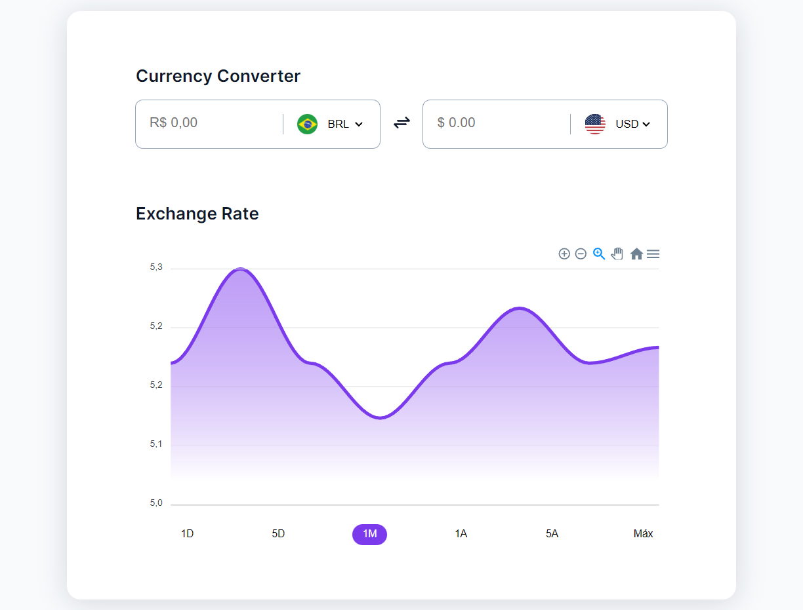

<h1 align="center">Currency-Exchange 📈</h1>

<p align="center">
Developing an interactive and responsive Currency Converter Aplication 🤑
</p>

<p align="center">
  <a href="#-technologies">Technologies</a>&nbsp;&nbsp;&nbsp;|&nbsp;&nbsp;&nbsp;
  <a href="#-project">Project</a>&nbsp;&nbsp;&nbsp;|&nbsp;&nbsp;&nbsp;
  <a href="#-layout">Layout</a>&nbsp;&nbsp;&nbsp;|&nbsp;&nbsp;&nbsp;
  <a href="#-license">License</a>&nbsp;&nbsp;&nbsp;|&nbsp;&nbsp;&nbsp;
  <a href="#-contact">Contact</a>
</p>

<p align="center">
  
</p>

<p align="center">
    
</p>

## 🚀 Technologies

This project was developed with the following technologies:

- JavaScript
- API Rest
- HTML
- CSS
- GIT
- Figma
- [Apex Charts](https://apexcharts.com/)
- [Flag Icons](https://github.com/lipis/flag-icons)

## 💻 Project

Project of an interactive Currency Convertor application proposed by RocketSeat in the challenge #boraCodar 🚀. You can access the project online through [THIS LINK](https://thiagonevesalmeida.github.io/currency-exchange/)

## 📚 Explored concepts

```
# JavaScript

- API Rest
- fetch
- ES6 Modules
- Async/ Await
- Promises
- Object Deconstruction
- Classes
```

## 🔖 Layout

You can view the layout of the project through [THIS LINK](https://www.figma.com/community/file/1212757179376046656). You must have an account at [Figma](https://figma.com) to access it.

## 📝 License

This project is licensed under the MIT license.

## 📨 Contact

thiagonevesdealmeida@gmail.com

[linkedin.com/in/thiagonevesdealmeida](https://www.linkedin.com/in/thiagonevesdealmeida/) 